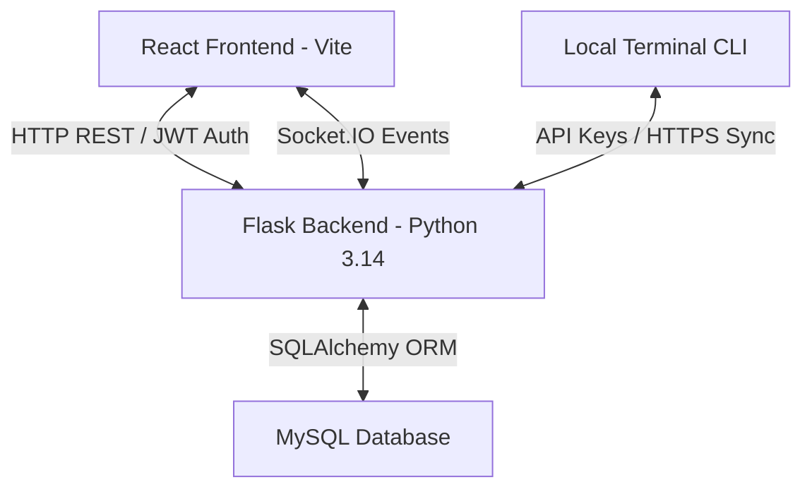

# TeamBridge System Architecture, Security, & Engineering Report

This report outlines the complete technical architecture, security protocols, API designs, development methodologies, and testing plans established for the TeamBridge hybrid project management and web IDE platform.

---

## 1. System Architecture & Tech Stack

TeamBridge is built using a modern decoupled client-server architecture designed for high responsiveness, real-time sync, and security.

### Frontend (Client-Side)
- **Framework**: **React 19 (Vite)** for compiling high-speed static assets.
- **Editor Harness**: **Monaco Editor React** (`@monaco-editor/react`) to simulate a full IDE inside the browser.
- **Styling Philosophy**: **Vanilla CSS** separated into module-specific stylesheets (e.g. [Settings.css](file:///d:/Ptojects/TeamBridge/teambridge-frontend/src/pages/Settings/Settings.css), [workspace.css](file:///d:/Ptojects/TeamBridge/teambridge-frontend/src/workspace/workspace.css)) to avoid bloated utility classes and enforce strict scoped styling.

### Backend (Server-Side)
- **Framework**: **Flask** (Python 3.14). Flask acts as a robust RESTful API Gateway.
- **ORM & Database**: **SQLAlchemy** connected to a **MySQL** datastore, managing relational mapping (Users, Teams, Keys, Sessions).
- **Real-Time Layer**: **Flask-SocketIO** (WebSocket protocol wrapper) handling instantaneous typing synchronization, notifications, and telemetry updates.

---

## 2. Real-Time Synchronization (Socket.IO)

Socket.IO handles persistent, bi-directional, low-latency communication between the client browser and the backend:
- **Workspace Rooms**: When a user enters `/workspace/editor/:teamCode`, the frontend emits a `join` event to join a socket room matching their `teamCode`.
- **Typing Synchronization**: Typing changes inside the Monaco editor emit file sync events to the room, updating other connected peer editors instantly.
- **Activity Streams**: Heartbeat logs generated by users are broadcast to guides/mentors in real-time, displaying line changes and typing speeds as dynamic SVG telemetry.
- **Notifications**: Invitation changes, guides review requests, and approvals emit events that trigger banner warnings instantly on other connected clients.

---

## 3. Security & Integrity Architecture

TeamBridge implements zero-trust security guidelines to protect proprietary code, databases, and login credentials:

### A. Explorer Locks (Zero-Trust Credentials)
- Attempting to open sensitive configuration structures (e.g. `.env`, `.key`, `secret.json`) inside the web IDE file explorer triggers a visual lock overlay.
- The web editor is blocked from fetching or writing to these configurations inside the browser client, preventing credentials theft and data leaks.

### B. Client-Side Cryptographic Messaging (SubtleCrypto)
- Chat channels use **End-to-End Encryption (E2EE)**. 
- The React client uses the browser's native **Web Crypto API** (`window.crypto.subtle`) to derive a 256-bit AES-GCM key derived from the shared project token.
- Chat text is encrypted locally into a Base64 ciphertext block *before* transmission. The Flask server and MySQL database store only ciphertext; plaintext is never exposed to database logs.

### C. Active Login Session Auditing & Revocation
- JWT tokens are hashed using SHA-256 (`hashlib.sha256`).
- Hashes are registered inside the `user_sessions` database table alongside client IP addresses, OS types, and last active timestamps.
- **Session Revocation**: A user can revoke any session. Revocation sets `is_active = 0` for that token hash, instantly invalidating the JWT and logging out the target device on its next API call.

---

## 4. API Design & Integration Model

### REST Architecture
TeamBridge uses a stateless **REST API** architecture in Flask, structured via modular blueprints:
- `POST /api/login` and `POST /api/login/google`: Issue JWT bearer authentication tokens containing user contexts.
- `GET /api/v1/user/settings` and `PATCH /api/v1/user/settings`: Retrieve and commit user-scoped preferences.
- `GET /api/workspace/files` and `POST /api/workspace/files/save`: Manage folder tree indexing and saving.
- All requests are authorized using HTTP headers: `Authorization: Bearer <JWT_Token>`.

### CLI Key Generation Mechanism (`tb_live_...`)
Local developer terminals authenticate with the platform using cryptographic API keys:
1. **Generation**: When a user requests a CLI key, the backend uses Python's `secrets` module to generate a cryptographically secure, random 24-byte hex token prefixed with `tb_live_`.
2. **Hashing**: The raw key is hashed using SHA-256, and only the hash is stored in `user_api_keys.key_hash`.
3. **Previewing**: The UI displays a masked key preview (e.g. `tb_live_••••a1b2`).
4. **Verification**: When the local terminal syncs with the Flask API (using `tb link` or `tb push`), it passes the raw key. The backend hashes the incoming key and verifies if a matching hash exists in the database.

---

## 5. Software Development Methodology: Agile/Scrum

TeamBridge development is driven by **Agile/Scrum** methodologies rather than Waterfall:
- **Waterfall vs Agile**: Waterfall requires massive up-front specifications and sequential stages. Because TeamBridge integrates web IDE workspaces, dynamic file trees, and real-time syncing, we require rapid feedback loops. Agile allows us to ship, compile, and test micro-features sequentially.
- **Sprint Iteration**: Features are broken down into granular checklists (tracked in [task.md](file:///C:/Users/ADMIN/.gemini/antigravity-ide/brain/6cd95015-532f-431e-b057-6e7836c23e6a/task.md)). 
- **Continuous Integration**: Code updates are compiled and validated (`npm run build` and `verify_environment.py`) immediately to ensure syntax completeness.

---

## 6. Testing & Quality Assurance Plan

To ship a production-grade system, TeamBridge requires three tiers of automated testing:

| Testing Tier | Technology | Target Coverage |
| :--- | :--- | :--- |
| **Unit Testing** | `pytest` (Backend) / `Vitest` (Frontend) | Verifies route controllers, data serialization formatting, input bounds, and user-agent string parsing helpers. |
| **Integration Testing** | `pytest-flask` | Validates session revocation logic (verifying that once a session is revoked, subsequent HTTP calls return `401 Unauthorized`). |
| **End-to-End (E2E) Testing** | `Cypress` or `Playwright` | Simulates a full user login, nav options clicking, theme switching, ignored extensions chip addition, and Monaco Editor typing syncs. |
| **Security Auditing** | `Bandit` (Python) / `npm audit` | Audits libraries for security bugs, checks for raw SQL injections, and ensures dependencies do not leak credentials. |

### Manual Verification Checklist
- Run `verify_environment.py` during deployment checkouts.
- Inspect developer network consoles to confirm that no E2EE chat messages travel in plaintext.
- Confirm visual dark-mode adaptations cover both layout wrappers and Monaco canvas boundaries.
